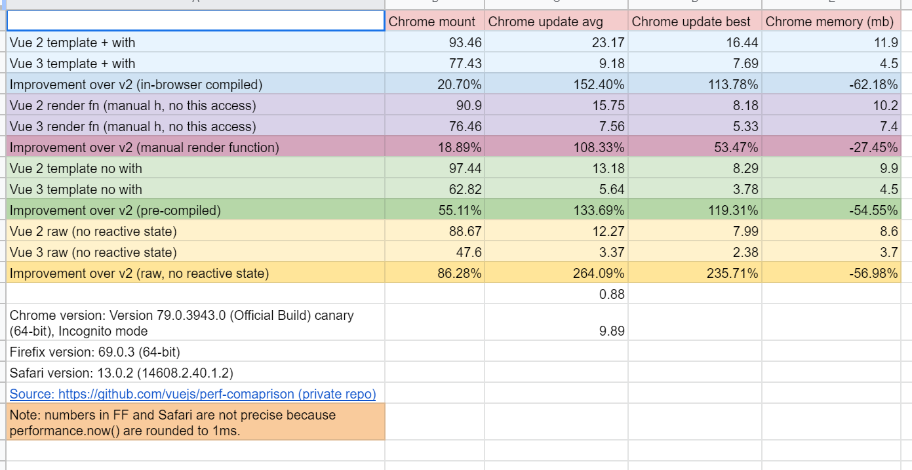

# Vue3整体解读


Vue3可以说对vue的程序应该如何写，重新下了定义：

- JSX
- Typescript
- Composition API
- reativity

上面4个更新虽然不全是vue3带来的，但是我们可以放到一起分析，算作对`vue-next` 程序的定义。

## Why Not SFC?

有同学可能会问？ SFC不香吗？

我们来看看，在TS环境下，SFC需要一个`shim` 文件：

```tsx
declare module "*.vue" {
  import { DefineComponent } from "vue";
  const Component: DefineComponent;
  export default Component;
}
```

`declare` 的作用是？ ——告诉Typescript编译器 `declare` 的部分在源代码之外提供，不需要编译器处理。当遇到"*.vue"的文件的时候，TS编译时先将他们当做一个会`export default Component` 的类型。

如果用`tsx` 写，就不需要这个`shim` 。

有同学会问：多一个`shim` 少一个`shim` 重要吗？ ——从架构角度重要！通常你的项目概念越多，意味着设计越差。

当然这只是一个给你一个开胃菜，还有很多其他的原因。

其实是在`SFC` 中你需要写`template` 和`script` 标签，这个方式有两个缺点：

- 这样的设计不够灵活
  - 需要v-show/v-if/v-for等
  - 关注点被分离（模板也好、script也好，都是解决某个关注点的一部分，在SFC中被强行分离了）。你可以思考一个template和script都很长的场景。
- TS的类型检查
  - 函数组件可以最大程度复用TS的类型检查（比如检查属性）

我们来看一个`vue` 的计数器程序：

参考文件：Counter.tsx

```tsx
function useCounter() : [Ref<number>, () => void]{
	const counter = ref(0) 

	function increment(){
		counter.value ++
	}

	return [counter, increment]
}

export default {
	setup() {
		const [counter, increment] = useCounter()
		return () => <div>
			count is : {counter.value}
			<button onClick={increment}>add</button>
		</div>
	}
}
```

从这个程序你看到了什么？

- counter逻辑的集中管理
- 强大的封装能力
- 少量的记忆要求


## 

## Vue3.0的性能

下面是Report，可以看到vue3带来了不错的性能增长。



## Composition API提升了什么？


- 提升了组合能力(自定义的Composition API)
- Reactive
- 函数式（简化API设计）


